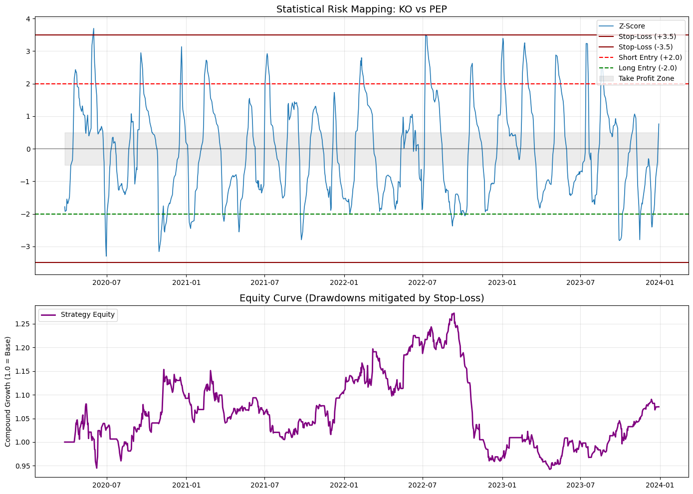

# 📉 Vectorized Statistical Arbitrage Engine

[](https://img.shields.io/badge/python-3.9+-blue.svg)
[](https://img.shields.io/badge/License-MIT-green.svg)
[](https://img.shields.io/badge/Status-Production--Ready-brightgreen.svg)

An institutional-grade, highly optimized backtesting engine designed to execute **Pairs Trading** strategies based on financial asset cointegration. This engine is built to identify market inefficiencies, mitigate systemic risk via market neutrality, and execute with sub-millisecond precision.

---

## 🧠 Quant Architecture & Mathematics

Unlike directional trading models, this engine generates **Alpha** by exploiting the mean-reversion properties of cointegrated assets.

### Mathematical Foundations

The model utilizes a **Rolling OLS (Ordinary Least Squares)** regression to determine the optimal hedge ratio ($\beta$), maintaining a delta-neutral portfolio:

$$Spread_t = Y_t - (\beta \cdot X_t)$$

To trigger trades, we calculate the **Z-Score** of the spread, ensuring our entries are based on statistical extremity relative to the rolling mean ($\mu$) and standard deviation ($\sigma$):

$$Z_t = \frac{Spread_t - \mu_t}{\sigma_t}$$

### Institutional Features:

- **Dynamic Hedge Ratio:** Prevents Look-Ahead Bias by calculating rolling covariance and variance, ensuring the model only uses historically available data.
- **Stateful Entry/Exit Logic:** Positions open at `z_entry`, are held through the noise band, and close on mean-reversion at `z_exit` — not the moment the signal weakens.
- **Integrated Hard Stop-Loss:** A risk-topology safeguard. When $\vert{}Z_t\vert{} > 3.5$, the engine assumes a breakdown in cointegration and triggers an emergency liquidation to protect capital.
- **Market Neutrality:** By holding offsetting positions in correlated assets (e.g., KO/PEP), the strategy remains insulated from broad market beta.
- **Vectorized Engine:** Optimized for performance; zero `for` loops in the core strategy logic. The entire pipeline leverages Pandas matrix transformations for high-frequency backtesting capabilities.

---

## 📊 Strategy Performance Analysis

The engine generates a dual-plot dashboard designed to provide visual evidence of statistical stationarity.



### 1. Statistical Risk Mapping (Upper Chart)

- **Z-Score (Blue Line):** Quantifies the deviation from the rolling mean.
- **Entry Thresholds ($\pm 2.0\sigma$):** Automated signals for opening positions.
- **Exit Zone (Gray Band):** The target state where the spread reverts to its historical fair value.
- **Hard Stop-Loss ($\pm 3.5\sigma$):** Critical risk mitigation logic.

### 2. Equity Curve (Lower Chart)

- **Drawdown Mitigation:** Illustrates how the model survives market shocks (e.g., March 2020) by capping exposure via the Stop-Loss logic.
- **Real-World Friction:** Performance accounts for 10 Bps transaction costs, proving strategy viability in real broker conditions.

---

## 🚀 Quick Start

### 1. Prerequisites

Ensure you have the required libraries installed:

```bash
pip install -r requirements.txt
```

### 2. Configuration

All strategy, market, and simulation parameters live in `config.json`:

```json
{
  "trading_params": {
    "z_entry": 2.0,
    "z_exit": 0.5,
    "z_stop": 3.5,
    "window_size": 30
  },
  "market_data": {
    "start_date": "2020-01-01",
    "end_date": "2024-01-01",
    "transaction_cost": 0.001
  },
  "portfolio": {
    "asset_y": "KO",
    "asset_x": "PEP"
  },
  "simulation_params": {
    "monte_carlo_runs": 500,
    "param_variation": 0.1
  }
}
```

| Section | Key | Description |
|---|---|---|
| `trading_params` | `z_entry` | Z-score threshold that opens a position |
| | `z_exit` | Z-score threshold (absolute) that closes a position on mean-reversion |
| | `z_stop` | Z-score threshold (absolute) that triggers the hard stop-loss |
| | `window_size` | Rolling window (in trading days) used for the hedge ratio, spread mean/std. Kept fixed during Monte Carlo — only `z_entry`, `z_exit`, and `z_stop` are perturbed. |
| `market_data` | `start_date` / `end_date` | Backtest date range |
| | `transaction_cost` | Per-trade friction, in decimal (e.g. `0.001` = 10 bps) |
| `portfolio` | `asset_y` / `asset_x` | Tickers for the pair (must be cointegrated) |
| `simulation_params` | `monte_carlo_runs` | Number of Monte Carlo iterations |
| | `param_variation` | +/- fractional range used to perturb `trading_params` (except `window_size`) |

Swap `asset_y` / `asset_x` for any other cointegrated pair, and adjust the date range or thresholds as needed — no code changes required.

### 3. Run the Engine

```bash
python backtester.py
```

This will:
1. Download historical price data for the configured pair via `yfinance`.
2. Run a single backtest and render the dual-panel dashboard (`performance_chart.png`), printing the estimated cumulative return.
3. Run the Monte Carlo robustness simulation and display a histogram of cumulative returns across perturbed parameter sets.

---

## License

MIT License — see [LICENSE](LICENSE) for details.
